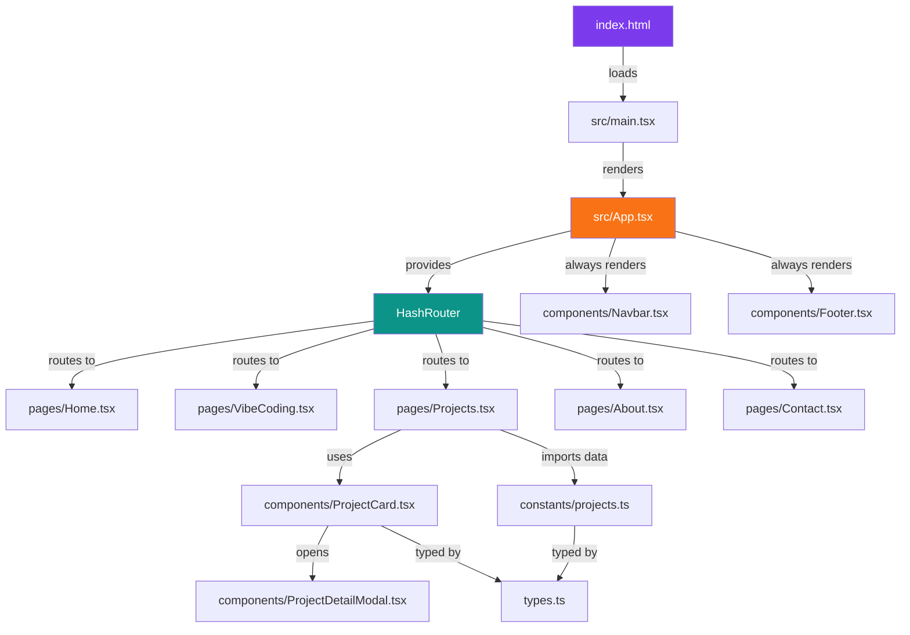
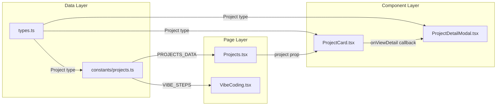

# 📐 Arsitektur Proyek — My-Porto

> Portfolio website **Muhammad Shibghotul 'Adalah (Igo)** — IT Support & Freelance Web Developer.  
> Dibangun dengan **React + TypeScript + Vite + Tailwind CSS v4**.

---

## 📁 Struktur Direktori

```
My-Porto/
├── index.html                 # Entry point HTML utama (Vite SPA)
├── package.json               # Dependencies & scripts NPM
├── vite.config.ts             # Konfigurasi build tool Vite
├── tsconfig.json              # Konfigurasi TypeScript compiler
├── metadata.json              # Metadata proyek (nama, deskripsi, capabilities)
├── .env.example               # Template environment variables
├── .gitignore                 # File/folder yang diabaikan Git
├── README.md                  # Dokumentasi umum proyek
│
├── assets/                    # Aset statis (gambar, ikon, dsb.)
│   └── .aistudio/             # Konfigurasi AI Studio
│
└── src/                       # 🔥 Source code utama aplikasi
    ├── main.tsx               # Bootstrap React — render <App /> ke DOM
    ├── App.tsx                 # Root component — routing & layout utama
    ├── index.css              # Global styles, design tokens, custom utilities
    ├── types.ts               # TypeScript interfaces & type definitions
    │
    ├── components/            # 🧩 Komponen UI reusable
    │   ├── Navbar.tsx         # Navigasi sticky dengan mobile hamburger menu
    │   ├── Footer.tsx         # Footer dengan info, navigasi, & social links
    │   ├── ProjectCard.tsx    # Kartu project dengan kategori & preview
    │   └── ProjectDetailModal.tsx  # Modal detail project (fullscreen overlay)
    │
    ├── pages/                 # 📄 Halaman-halaman utama (route-based)
    │   ├── Home.tsx           # Landing page / hero section
    │   ├── VibeCoding.tsx     # Halaman vibe-coding workflow
    │   ├── Projects.tsx       # Showcase semua project
    │   ├── About.tsx          # Halaman tentang Igo
    │   └── Contact.tsx        # Halaman kontak / form hubungi
    │
    └── constants/             # 📦 Data statis & konfigurasi
        └── projects.ts        # Data semua project & vibe-coding steps
```

---

## 🏗️ Arsitektur Aplikasi

### Diagram Alur



---

## 🔧 Tech Stack

| Kategori | Teknologi | Versi | Keterangan |
|----------|-----------|-------|------------|
| **Framework** | React | 19.x | UI library utama |
| **Bahasa** | TypeScript | 5.8.x | Type safety |
| **Build Tool** | Vite | 6.x | Dev server & bundler super cepat |
| **Styling** | Tailwind CSS | 4.x | Utility-first CSS framework |
| **Routing** | React Router DOM | 7.x | Client-side routing (HashRouter) |
| **Animasi** | Motion (Framer Motion) | 12.x | Animasi deklaratif & transisi |
| **Ikon** | Lucide React | 0.546.x | Ikon SVG modern & konsisten |
| **AI** | @google/genai | 2.4.x | Integrasi Gemini AI API |
| **Analytics** | Vercel Analytics | 2.x | Web analytics |
| **Performance** | Vercel Speed Insights | 2.x | Monitoring performa |
| **Font** | Google Fonts | — | Plus Jakarta Sans, Space Grotesk, JetBrains Mono |

---

## 📄 Penjelasan Detail Tiap File

### Root Files

| File | Fungsi |
|------|--------|
| [`index.html`](index.html) | Entry point HTML. Berisi `<div id="root">` sebagai mount point React dan memuat `src/main.tsx` sebagai module script. Title sudah di-set untuk SEO. |
| [`package.json`](package.json) | Mendefinisikan nama proyek (`react-example`), scripts (`dev`, `build`, `preview`, `clean`, `lint`), serta seluruh dependencies dan devDependencies. |
| [`vite.config.ts`](vite.config.ts) | Konfigurasi Vite — mengaktifkan plugin React & Tailwind CSS, path alias `@` ke root, serta pengaturan HMR yang bisa di-disable via env variable `DISABLE_HMR`. |
| [`tsconfig.json`](tsconfig.json) | Konfigurasi TypeScript — target ES2022, module ESNext, JSX `react-jsx`, path alias `@/*`, dan `noEmit` (hanya type-checking). |
| [`metadata.json`](metadata.json) | Metadata proyek untuk deployment platform (AI Studio) — berisi nama, deskripsi, dan kapabilitas server-side Gemini API. |
| [`.env.example`](.env.example) | Template environment variables: `GEMINI_API_KEY` untuk API calls dan `APP_URL` untuk URL hosting. |
| [`.gitignore`](.gitignore) | Mengabaikan `node_modules/`, `dist/`, `build/`, `coverage/`, `.DS_Store`, `*.log`, dan file `.env` (kecuali `.env.example`). |

---

### `src/` — Source Code

#### Entry Point & Root

| File | Fungsi |
|------|--------|
| [`main.tsx`](src/main.tsx) | Bootstrap aplikasi — import `index.css`, lalu render `<App />` ke dalam elemen `#root` menggunakan `createRoot()` di dalam `StrictMode`. |
| [`App.tsx`](src/App.tsx) | Root component. Menggunakan `HashRouter` untuk routing. Struktur layout: `Navbar` (sticky top) → `Routes` (main content) → `Footer`. Juga include `ScrollToTop` helper, Vercel Analytics, dan Speed Insights. |
| [`index.css`](src/index.css) | Global stylesheet. Import Tailwind CSS v4 dan Google Fonts. Mendefinisikan **design tokens** via `@theme` (warna brand, font families), custom scrollbar, efek shadow playful, gradient text, mesh background, dan animasi custom. |
| [`types.ts`](src/types.ts) | Definisi TypeScript interfaces: `Project` (data proyek), `VibeStep` (langkah vibe-coding), dan `ContactMessage` (pesan kontak). |

#### `components/` — Komponen Reusable

| Komponen | Fungsi |
|----------|--------|
| [`Navbar.tsx`](src/components/Navbar.tsx) | Navigasi utama — sticky top, backdrop blur, responsive. Ada hamburger menu untuk mobile dengan animasi `AnimatePresence`. Logo "igo.dev" di kiri, nav links di kanan. Menggunakan `NavLink` untuk active state styling. |
| [`Footer.tsx`](src/components/Footer.tsx) | Footer 4-kolom: brand info, navigasi cepat, social links (GitHub, LinkedIn, WhatsApp), dan copyright. Dark theme (`bg-slate-900`). |
| [`ProjectCard.tsx`](src/components/ProjectCard.tsx) | Kartu untuk menampilkan preview project. Menampilkan gambar, kategori (dengan warna berbeda per kategori: Client/Internal/Personal), judul, tagline, tech stack badges, dan tombol detail/link. Props: `project` data & callback `onViewDetail`. |
| [`ProjectDetailModal.tsx`](src/components/ProjectDetailModal.tsx) | Modal overlay fullscreen untuk detail project. Menampilkan info lengkap: masalah, solusi, fitur, tech stack, role, dan link. Auto-disable body scroll saat terbuka. Animasi masuk/keluar via Motion. |

#### `pages/` — Halaman Route

| Halaman | Route | Fungsi |
|---------|-------|--------|
| [`Home.tsx`](src/pages/Home.tsx) | `/` | Landing page utama — hero section dengan intro dan CTA. |
| [`VibeCoding.tsx`](src/pages/VibeCoding.tsx) | `/vibe-coding` | Halaman yang menjelaskan workflow vibe-coding Igo — step-by-step proses development dengan AI. |
| [`Projects.tsx`](src/pages/Projects.tsx) | `/projects` | Showcase semua project — grid `ProjectCard` dengan filter kategori. Modal detail terbuka saat klik. |
| [`About.tsx`](src/pages/About.tsx) | `/about` | Halaman tentang — profil, skill, pengalaman, dan personality Igo. |
| [`Contact.tsx`](src/pages/Contact.tsx) | `/contact` | Form kontak — nama, email, pesan. Kemungkinan ada integrasi API untuk submit. |

#### `constants/` — Data Statis

| File | Fungsi |
|------|--------|
| [`projects.ts`](src/constants/projects.ts) | Menyimpan array `PROJECTS_DATA` (data semua proyek) dan `VIBE_STEPS` (langkah-langkah vibe-coding). Setiap proyek punya: id, title, tagline, description, problem, solution, features, techStack, role, category, imageUrl, dan optional projectUrl/githubUrl. |

---

## 🎨 Design System

### Warna Brand

| Token | Hex | Penggunaan |
|-------|-----|------------|
| `brand-purple` | `#7c3aed` | Warna utama — logo, CTA, aksen |
| `brand-orange` | `#f97316` | Warna sekunder — highlight, tagline |
| `brand-teal` | `#0d9488` | Aksen — badge, kategori client |
| `brand-yellow` | `#facc15` | Aksen — selection highlight, dekorasi |
| `brand-dark` | `#0f172a` | Warna gelap — text, shadow, border |

### Font Families

| Token | Font | Penggunaan |
|-------|------|------------|
| `font-sans` | Plus Jakarta Sans | Body text utama |
| `font-display` | Space Grotesk | Heading & display text |
| `font-mono` | JetBrains Mono | Kode & label teknis |

### Custom Utilities

- **`.playful-shadow`** / **`.playful-shadow-hover`** — Efek shadow neo-brutalist (hitam)
- **`.playful-shadow-accent`** / **`.playful-shadow-accent-hover`** — Efek shadow neo-brutalist (ungu)
- **`.mesh-bg`** — Background gradient mesh multi-warna halus
- **`.text-gradient-purple-orange`** — Gradient text ungu → oranye
- **`.text-gradient-teal-yellow`** — Gradient text teal → kuning
- **`.animate-pulse-slow`** — Animasi pulse lambat (4 detik)

---

## 🔀 Routing

Aplikasi menggunakan **`HashRouter`** dari React Router DOM v7, yang menghasilkan URL dengan format `/#/path`.

| Route | Halaman | Keterangan |
|-------|---------|------------|
| `/#/` | Home | Landing page |
| `/#/vibe-coding` | Vibe Coding | Workflow vibe-coding |
| `/#/projects` | Projects | Showcase project |
| `/#/about` | About | Profil Igo |
| `/#/contact` | Contact | Form kontak |
| `/#/*` (wildcard) | Home | Fallback — redirect ke Home |

> **Kenapa HashRouter?** Supaya kompatibel dengan hosting statis (GitHub Pages, Vercel static) tanpa perlu konfigurasi server-side redirect.

---

## 📦 NPM Scripts

| Script | Perintah | Fungsi |
|--------|----------|--------|
| `dev` | `vite --port=3000 --host=0.0.0.0` | Dev server lokal di port 3000 |
| `build` | `vite build` | Build production ke folder `dist/` |
| `preview` | `vite preview` | Preview hasil build production |
| `clean` | `rm -rf dist server.js` | Hapus folder build & server file |
| `lint` | `tsc --noEmit` | Type-checking tanpa output |

---

## 🧭 Alur Data



**Pola alur data:**
1. **Data statis** didefinisikan di `constants/projects.ts` dengan type dari `types.ts`
2. **Pages** import data dan render ke dalam **Components**
3. **Components** menerima data via **props** dan mengirim event via **callbacks**
4. Tidak ada state management global (Redux/Zustand) — state hanya di-manage lokal per komponen

---

## 🚀 Deployment

- **Build tool**: Vite (output ke `dist/`)
- **Hosting**: Mendukung Vercel, GitHub Pages, atau hosting statis lainnya
- **Analytics**: Vercel Analytics & Speed Insights sudah terintegrasi
- **AI Integration**: Gemini API via `@google/genai` (membutuhkan `GEMINI_API_KEY`)

---

> 📝 *Dokumentasi ini di-generate berdasarkan analisis struktur kode aktual proyek.*
